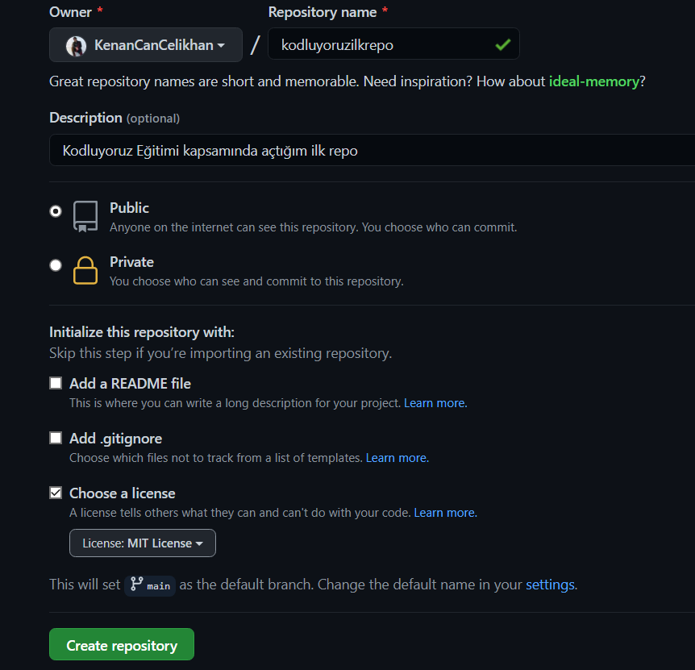

# Kodluyoruz İlk Repo
---
Bu repo [Kodluyoruz](https://www.kodluyoruz.org/) Front-End Eğitiminde oluşturduğumunz ilk repodur. İçerisinde bir adet READNE dosyası ,bir adet index.html barındırıyor.

## İnstallation
---
Önceki projeyi clonlayın .(buraya sizin reponuzdan aldığınız link gelecek)

https://github.com/KenanCanCelikhan/kodluyoruzilkrepo.git

## Usage 
---
Projeyi cloneledikten sonra visual Studio Code programında açınız

Linux için :

cd kodluyoruzilkrepo
code .

## Contributing 
---
Pull requestler kabul edilir. Büyük değişiklikler için , lütfen önce neyi değiştirmek istediğiniz taetışmak için bir konu açınız

## License
---

[MİT](https://choosealicense.com/licenses/mit/)

